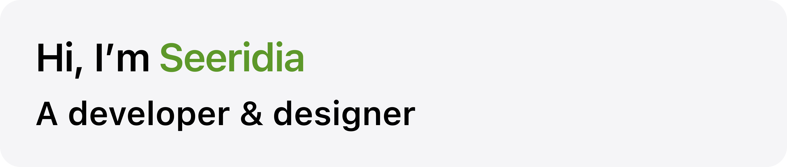
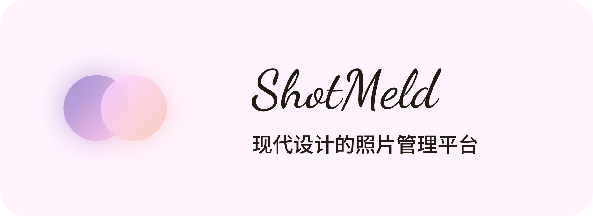
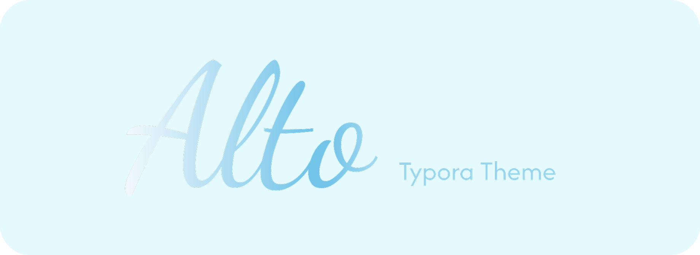
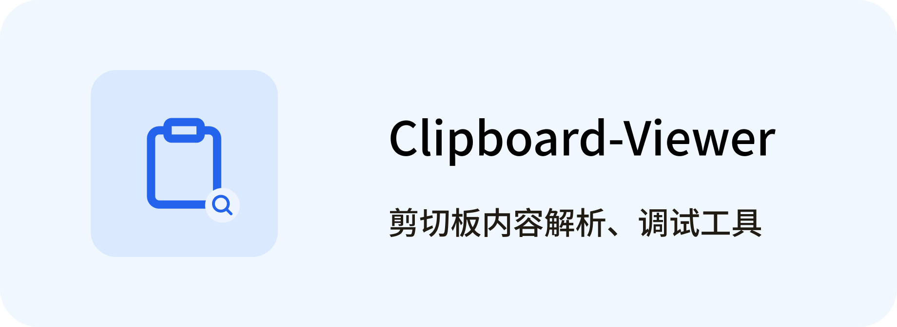
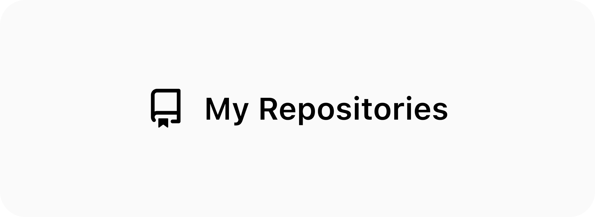
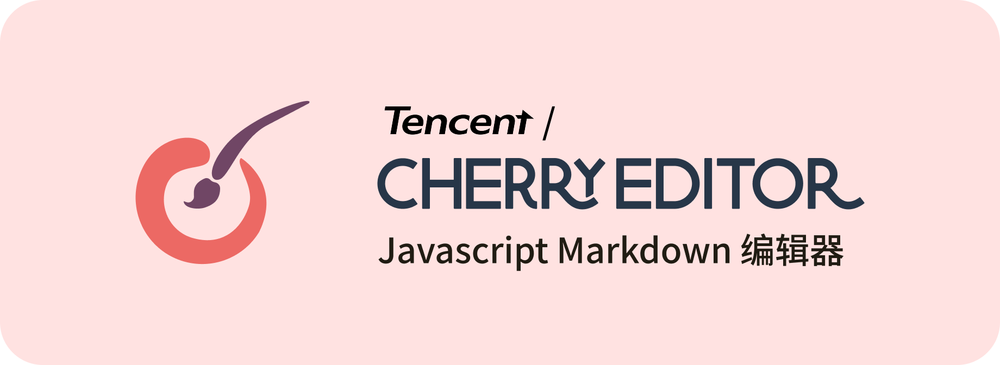
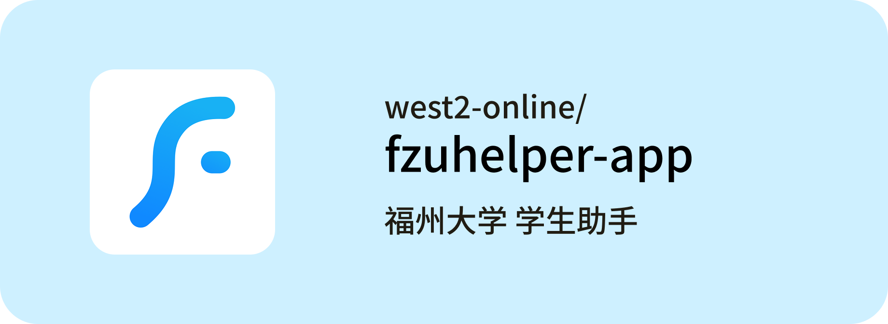
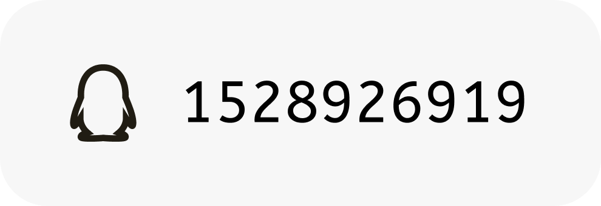
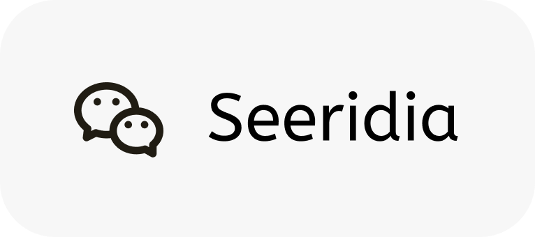
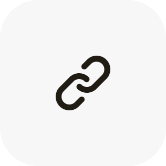

  &nbsp;
  

### My Works

  
  &nbsp;&nbsp;
  

  
  &nbsp;&nbsp;
  

### My Contributions

  
  &nbsp;&nbsp;
  

### Contact Me

  
  &nbsp;&nbsp;
  
  &nbsp;&nbsp;
  
  &nbsp;&nbsp;
  

